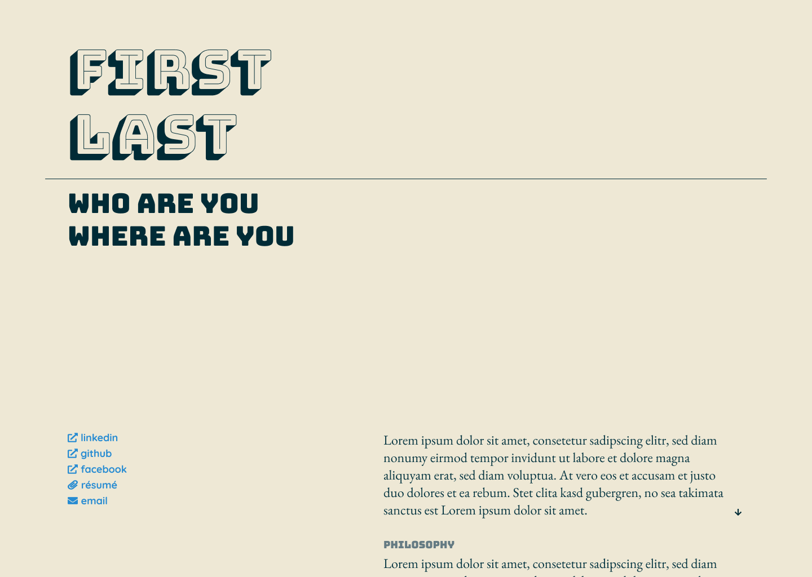
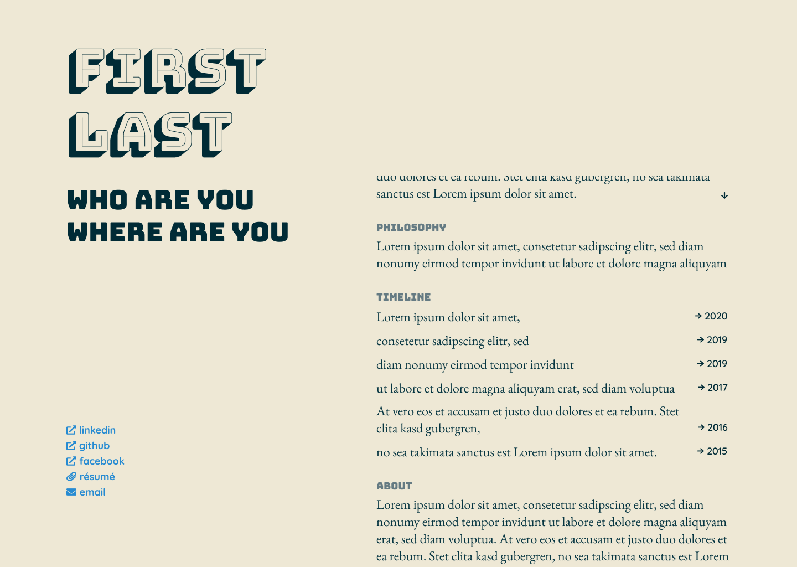
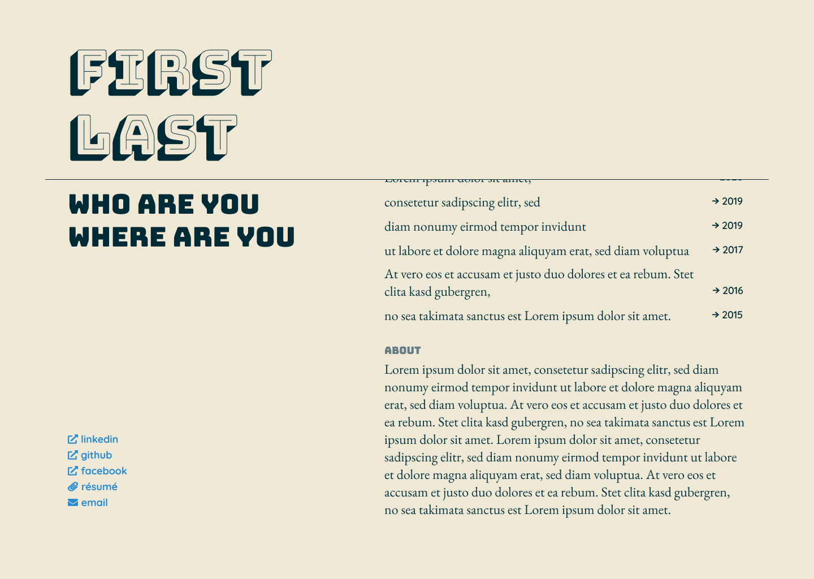

# Ratul Minhaz - Personal Portfolio

> [!NOTE]
> It's a work in progress and not ready for production. Feel free to fork and improve, PRs are welcome!

Being a backend heavy dev, I never got around properly fixing all the CSS gimmicks even though I had the original concept since 2018. I finally decided to fix the issues and make it a production ready 11ty template. Thanks to [Claude Code](https://claude.ai/code) and [Antigravity](https://antigravity.ai)!


## Original Design

The original Figma design can be found [here](./docs/design/).

My plan was to fix the title, subtitle, and social menu while the right-side content scrolled. The CSS challenge was achieving the effect of content vanishing under a top bar, like paper sliding into an envelope.

**Homepage**

**Homepage - Scroll Mid**

**Homepage - Scroll End**



## Tech Stack

Although for a while it was just a static HTML file, I realized I need something more robust to do the updates. I already used Hugo as a static site generator for my blog, so I decided to use 11ty for this portfolio. 

- **Static Site Generator**: [11ty](https://www.11ty.dev/)
- **Templating**: Nunjucks
- **Styling**: Modern CSS
- **JavaScript**: Vanilla JS
- **Deployment**: GitHub Pages

## Features

- **Configurable Design**: 
    - Manage colors, fonts, and configurations via JSON files in `src/_data/` without touching CSS.
    - Comes with a few pre-configured themes and fonts.
- **Lightweight**: Minimal dependencies, fast build times.
- **Responsive**: Mobile-first design with a responsive layout.
- **Responsive**: Mobile-first design with a responsive layout.

## How to use

### Content Management

Modify these JSON files in `src/_data/`:
- **`home.json`**: Edit the "Intro", "Timeline", and "About" sections.
- **`site.json`**: Name, description, active theme/font.
- **`social.json`**: Social media links.

### Theming & Fonts

This project comes with curated **Themes** (Solarized, Nord, etc.) and **Font Schemes** (Playful, Technical, etc.).

1.  **Check Available Options**:
    *   Open `src/_data/themes.json` for color themes.
    *   Open `src/_data/fonts.json` for font schemes.
2.  **Apply Changes**:
    *   Edit `src/_data/site.json` and update the `theme` or `fontScheme` property to match the key you want.


## Development

### Prerequisites

- Node.js 20+
- pnpm

### Setup

```bash
# Install dependencies
pnpm install

# Start development server
pnpm start

# Build for production
pnpm run build
```

## License

MIT
